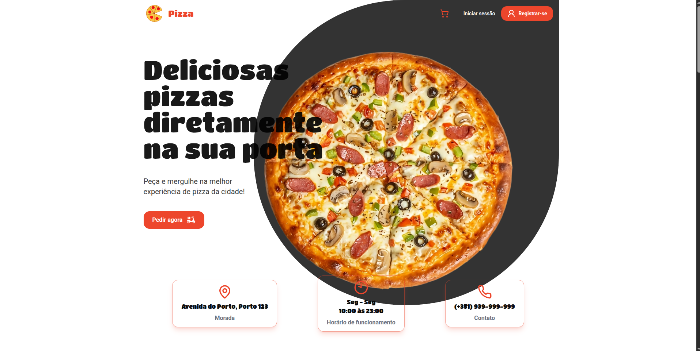

# 🚀 Pizza Shop

Página frontend da Pizzaria Shop

---

## 📸 Preview 

---

## 🔗 Demo

- 🌐 Live: https://pizza-dev-restaurant.vercel.app/  
- 📦 Repositório: https://github.com/zWellingtonLima/Pizza-Restaurant-Delivery

---

## 🧠 Sobre o Projeto

> Este projeto foi desenvolvido para praticar desenvolvimento frontend usando NextJs, estilização e responsividade usando bibliotecas como Tailwind, gerenciamento de estado global com zustand.

---

## ⚙️ Tecnologias Utilizadas

- **Frontend:** React / Next.js / Vite  
- **Estilização:** Tailwind CSS   
- **Gerenciamento de estado:** Zustand 
- **Outros:** ESLint, Zod.

---

## ✨ Funcionalidades
- [x] Responsividade  
- [ ] Integração com API  
- [ ] Autenticação de usuário  
- [ ] Pedido de Pizzas  
- [ ] Testes automatizados  
